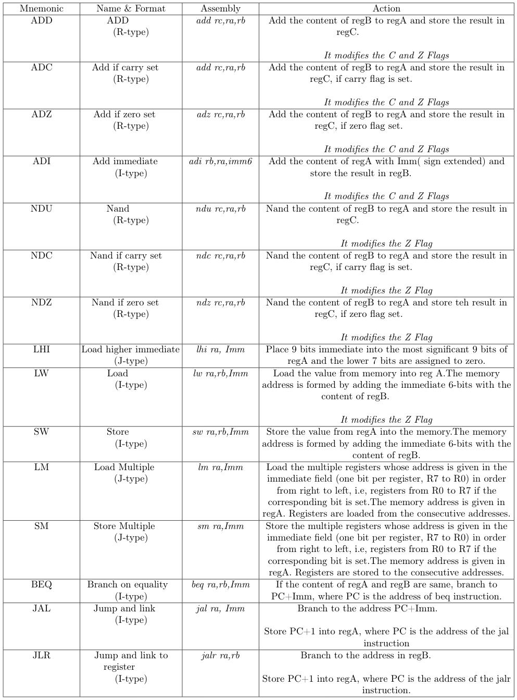

## Instruction Set

## Scripts

#### ` getprogram.py ` 
- This is the assembler that converts assembly code to machine readable bit stream that can be used to initialise the instruction ROM.
- takes assembly code file as input:
      
      python getprogram.py <path-to-program.txt>

**Note**: Assembler assumes the correctness of syntax of assembly code provided.
